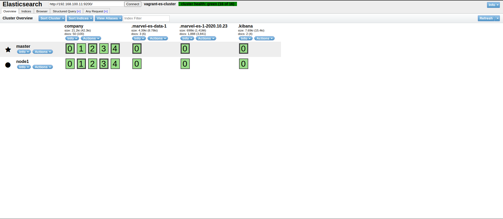
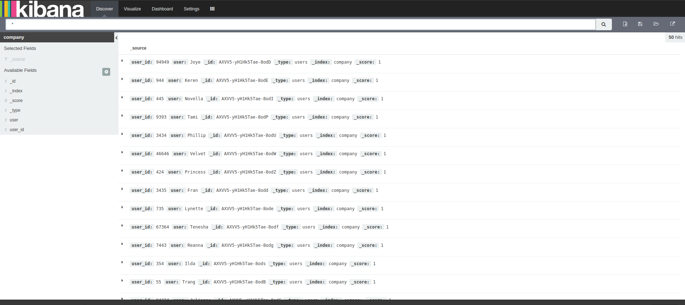

# Elasticsearch using Vagrant

An Elasticsearch (ES) cluster, consisting of a master and node created by Vagrant - both VMs are configured the same so either of the VMs can become master. There should be at least 3 nodes to prevent split brain, however this is just for expermenting.

Once the cluster is created, an index is created and dummy data is imported via a Python script.

##  Installation

```
$ git clone https://https://github.com/dobby-dobster/elasticsearch-vagrant
$ cd elasticsearch-vagrant && vagrant up
```

## Usage
One installation is complete, you can go to [http://192.168.100.11:9200/](http://192.168.100.11:9200/) and you should see something similar to:

```
  "name" : "master",
  "cluster_name" : "vagrant-es-cluster",
  "cluster_uuid" : "NkEc-bCBSveQgV1DFPmI3g",
  "version" : {
    "number" : "2.4.6",
    "build_hash" : "5376dca9f70f3abef96a77f4bb22720ace8240fd",
    "build_timestamp" : "2017-07-18T12:17:44Z",
    "build_snapshot" : false,
    "lucene_version" : "5.5.4"
  },
  "tagline" : "You Know, for Search"
}
```

You may also query the cluster health:

```
$curl http://192.168.100.11:9200/_cluster/health\?pretty
{
  "cluster_name" : "vagrant-es-cluster",
  "status" : "green",
  "timed_out" : false,
  "number_of_nodes" : 2,
  "number_of_data_nodes" : 2,
  "active_primary_shards" : 8,
  "active_shards" : 16,
  "relocating_shards" : 0,
  "initializing_shards" : 0,
  "unassigned_shards" : 0,
  "delayed_unassigned_shards" : 0,
  "number_of_pending_tasks" : 0,
  "number_of_in_flight_fetch" : 0,
  "task_max_waiting_in_queue_millis" : 0,
  "active_shards_percent_as_number" : 100.0
}
```

Also seeing the nodes:

```
$curl http://192.168.100.11:9200/_cat/nodes             
192.168.100.11 192.168.100.11 4 51 0.01 d * master 
192.168.100.12 192.168.100.12 7 54 0.11 d m node1  
```

The install includes some plugins:

* Head ([http://192.168.100.11:9200/_plugin/head](http://192.168.100.11:9200/_plugin/head/))


* Kibana ([http://192.168.100.11:5601/](http://192.168.100.11:5601/))


* Marvel ([http://localhost:5601/app/marvel](http://localhost:5601/app/marvel))

